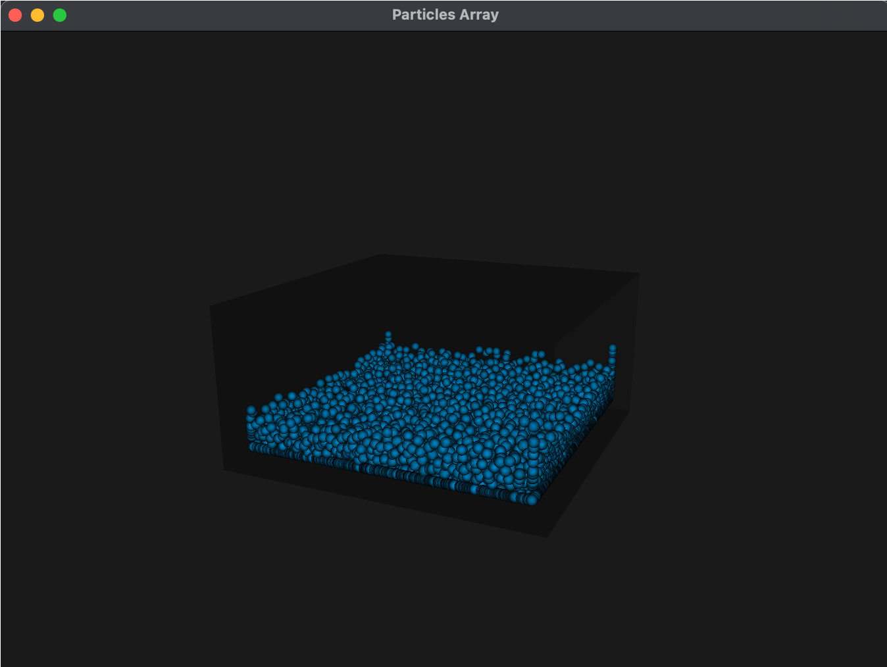
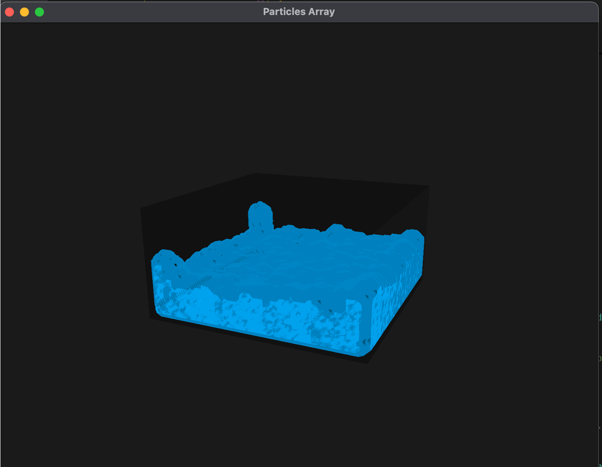
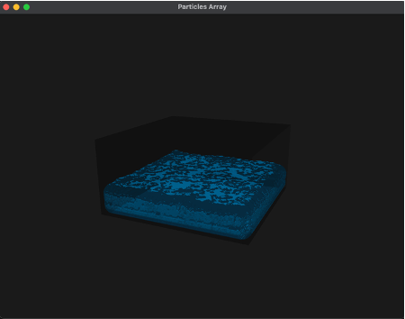
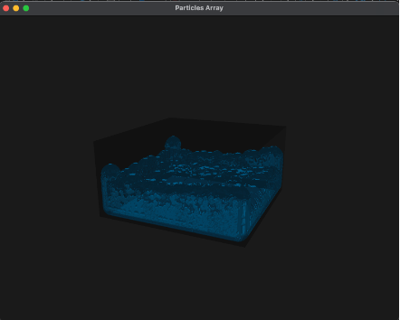

# 💧 SPH Fluid Simulator with Marching Cubes

This project implements a real-time 3D fluid simulator using **Smoothed Particle Hydrodynamics (SPH)** for physics and **Marching Cubes** for surface extraction. The result is a physically plausible, mesh-rendered fluid with lighting via **Phong shading**. The simulator is multithreaded and scalable, supporting thousands of particles at interactive frame rates.

---

## 🎮 Usage

Run the compiled executable with the following command:

```bash
./simulator [Render Mode] [Remeshing] [Phong Shading]
```

### Arguments

- **Render Mode**  
  `render` – Display fluid simulation in real time  
  `save` – Save each frame to disk (for offline rendering)  
  `load` – Load previously saved frames and replay

- **Remeshing**  
  `true` – Enable Marching Cubes mesh generation  
  `false` – Display particles as points or spheres

- **Phong Shading**  
  `true` – Enable smooth lighting  
  `false` – Use basic lighting model

### Example

```bash
./simulator render true true
```

Runs the simulator with real-time display, remeshing enabled, and Phong shading turned on.

---

## 🔧 Features

- Full SPH physics with pressure, viscosity, and gravity
- Spatial hashing for fast neighbor queries
- Marching Cubes surface remeshing
- Phong shading for realistic lighting
- Multithreaded simulation and surface extraction
- Support for real-time, offline, and replay modes

---

## 🧠 Implementation Summary

### SPH Physics

We implemented the full SPH pipeline:
- **Density and pressure** calculated using the poly6 kernel
- **Pressure and viscosity forces** using the spiky gradient and viscosity Laplacian
- **Euler integration** to update positions and velocities

### Spatial Hashing

Particles are sorted into a 3D spatial grid using a hash function to allow constant-time neighbor lookups. This reduces complexity from O(n²) to nearly O(n). The same hash structure is reused for both SPH and Marching Cubes.

### Marching Cubes

We voxelize the simulation space into a 3D scalar field where each cell samples a smoothed “color” value derived from nearby particles. Marching Cubes then:
- Interpolates vertices along edges where the iso-value is crossed
- Uses lookup tables to construct triangle indices
- Computes vertex normals for smooth shading
- Runs in parallel across multiple threads

### Performance

The simulator runs:
- **10,000 particles**
- With Marching Cubes and Phong shading
- At ~15 FPS on a multi-core CPU

This is significantly more scalable than basic SPH implementations, which typically bottleneck at this particle count *without* mesh reconstruction.

---

## 📉 Limitations

- Marching Cubes is currently **CPU-bound**  
  → Porting to a **GPU compute shader** would vastly improve performance
- Linear interpolation and naive grid spacing  
  → Can be improved with adaptive grids or higher-order smoothing

---

## 🧪 Dependencies

- C++17 or later
- [GLFW](https://www.glfw.org/) – window/context creation  
- [GLM](https://github.com/g-truc/glm) – vector/matrix math  
- OpenGL 3.3+  
- `stb_image_write.h` – frame dumping in `save` mode

---

## 📁 Output

- Real-time display via OpenGL window (`render` mode)
- Frame-by-frame PNG output in `frames/` (`save` mode)
- Replay from disk using `load` mode

---

## 📚 References

- Müller et al., *Particle-Based Fluid Simulation for Interactive Applications* (2003)  
  [PDF](https://matthias-research.github.io/pages/publications/sca03.pdf)

- Lorensen & Cline, *Marching Cubes: A High Resolution 3D Surface Construction Algorithm* (1987)  
  [PDF](https://dl.acm.org/doi/10.1145/37402.37422)

- [SPH Fluid Simulator (GitHub)](https://github.com/lijenicol/SPH-Fluid-Simulator) – Used for inspiration on threading

---

## 📸 Screenshots (Optional)






---

## 🧼 License

This project is for academic and educational use. Attribution to the original team members is appreciated if reused.
